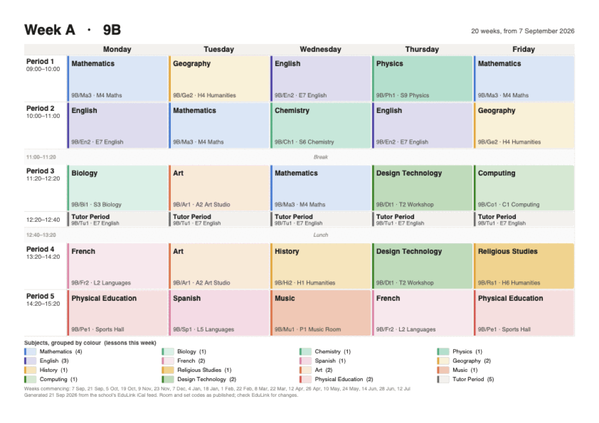
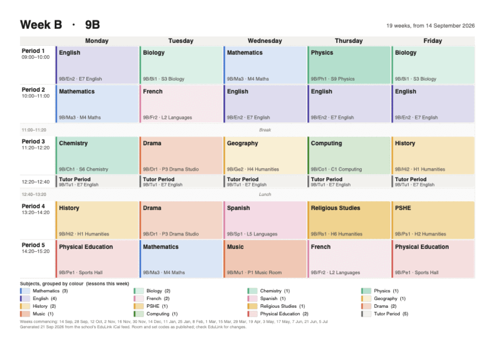

# ivc-timetable

Turns the school's EduLink iCal feed into one printable A4 PDF per week of the
timetable cycle — colour-coded by subject, with times, set codes and rooms.

## What it looks like

Two sheets per cycle, landscape A4, designed to be pinned up and read from a
few feet away: subject in bold, set code and room underneath, break and lunch
as full-width bands, and a legend counting that week's lessons per subject.





Both images are real output from the script, rendered from a made-up feed — an
invented group, set codes, rooms and term dates — so nothing here is anyone's
actual timetable.

## Run

Needs [`uv`](https://docs.astral.sh/uv/) (already installed here); it fetches
the one dependency, `reportlab`, on first run.

```sh
./timetable.py                 # feed from $ICAL_TIMETABLE_URL, PDFs into ./out
```

`.envrc` holds `ICAL_TIMETABLE_URL`, so with direnv active there is nothing else
to set up.

## Options

| Flag | What it does |
|---|---|
| `--url URL` | use a different feed |
| `--ics FILE` | read a saved `.ics` instead of fetching (offline, repeatable) |
| `--save-ics FILE` | keep a copy of the fetched feed |
| `--outdir DIR` | where the PDFs go (default `out/`) |
| `--portrait` | A4 portrait instead of landscape |
| `--swap-weeks` | swap which cycle week is labelled A and which B |
| `--cycle N` | force the cycle length instead of detecting it |

## How the A/B weeks are worked out

The feed has no A/B marker and no recurrence rules — just one event per lesson
for the whole year. The script indexes weeks by their position in the *teaching*
sequence rather than by calendar week, because a holiday removes a week from the
cycle instead of shifting it, then finds the shortest cycle length that explains
the data and takes a majority vote per (cycle week, weekday, period) cell.

Which of the two is really called "A" at school is a guess — use `--swap-weeks`
if it is the wrong way round. The `Weeks commencing:` line in each footer says
exactly which dates that sheet covers.

Each run also prints the holiday gaps it found and any one-off lesson or room
changes that differ from the regular fortnight.
